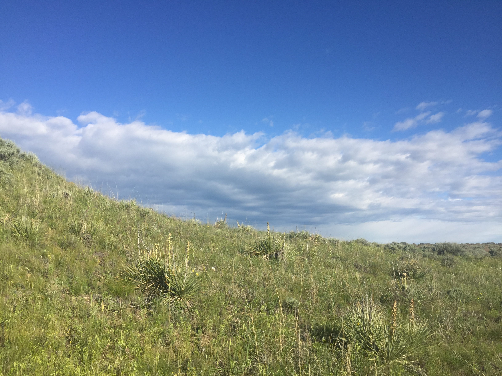
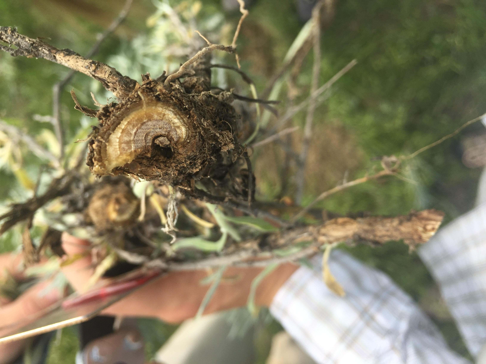
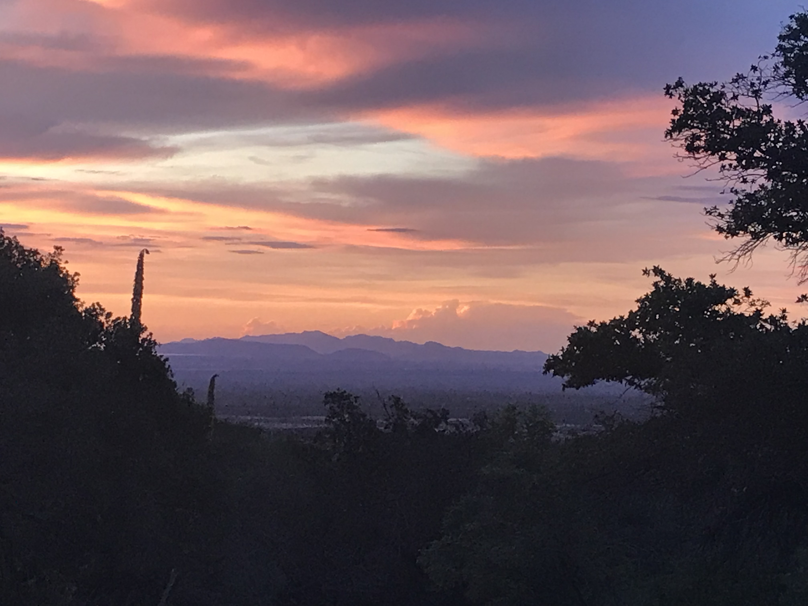
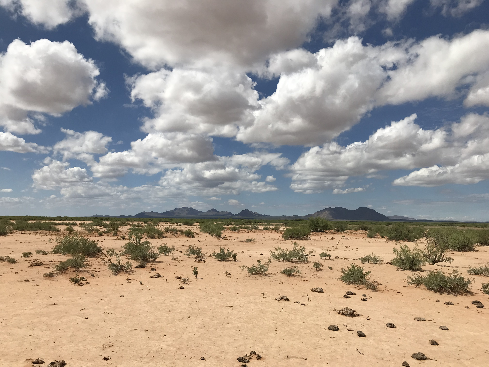

+++
title = "About"
description = ""
author = "Alice Stears"
date = "2023-01-20"
layout = "about"
tags = ["about"]
categories = ["about"]
[[images]] 
    src = "img/about/Jornada.jpg" 
    alt = "Desert Scene" 
    stretch = "stretchH"
+++

I am currently a Postdoctoral research associate at the University of Wyoming as part of both the [Weiss-Lehman lab group](https://weisslehmanlab.weebly.com/) and the [Modelscape consortium](https://microcollaborative.atlassian.net/wiki/spaces/MP/overview). I recieved my PhD in Ecology from the University of Wyoming in the [Program in Ecology and Evolution](http://uwyo.edu/pie/) and the [Botany Department](http://www.uwyo.edu/botany/), where I worked with Dr. Daniel Laughlin. 

I'm a plant ecologist excited about all sorts of questions, but am particularly interested in the impact of global change on the ecological processes that shape plant populations and communities. I use functional traits as tools to understand the mechanisms that drive plant responses to the environment, as well as to make predictions and draw conclusions about plant responses that are generalizable across species. I'm also excited about exploring new statistical and computational techniques to analyze and communicate ecological data. 
You can find more about my research projects **[here](http://astearsresearch.com/research/)**. 

Here is my **[CV](images/AStears_CV_2023_1.pdf)**

   
     
I grew up in Wyoming and Montana, and barring a four-year stint in western Massachussetts for undergrad, have lived in the Mountain West ever since. I'm passionate about conservation and management, particularly of our sprawling Western North-American landscapes, and especially enjoy thinking and learning about creative stewardship practices that recognize the necessary coexistence between human and non-human worlds. 

 

I feel very fortunate to have grown up in a place with such tremendous access to the outdoors, and for having a family and community that encouraged recreating in and learning about the natural world. As I'm sure is common with many ecologists, I can trace my interest in science and natural history directly to my early experiences outside. I care a lot about expanding access to the outdoors and exposure to field science, particularly for young people, so that every kid has the opportunity to learn about and be fascinated by nature. These experiences are transformative, and shouldn't be limited to those of us who are lucky enough to live with mountains, prairies, or streams in our back yard.  

   

When I'm not doing science, I'm likely doing one of the following:  

* hanging out with my [dog](images/JujuPic.jpeg)       
* skiing in the backcountry as much as possible  
* riding a mountain bike (and very occassionally a road bike, as long as the Wyoming wind isn't howling too hard)
* botanizing
* trail running, climbing, hiking, hammocking, or really anything else outside
* eating and cooking tasty food  
* knitting, sewing, or making other things by hand    

If you're interested in my non-science endeavors and want to find out more, click [here](http://astearsresearch.com/fun/). 

   

