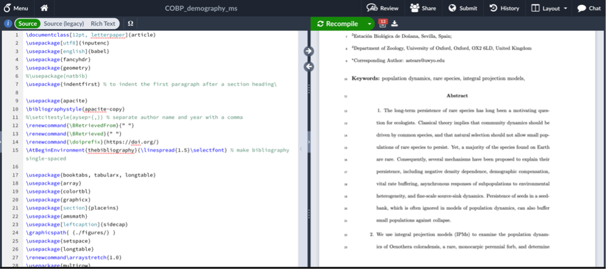
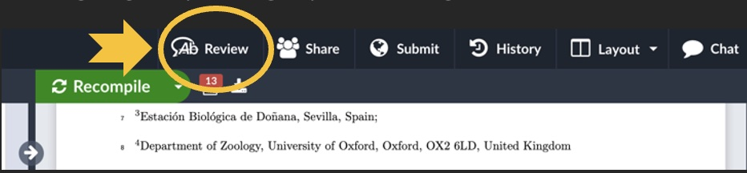
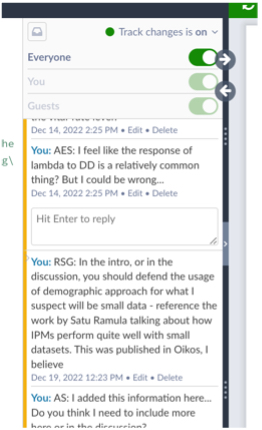
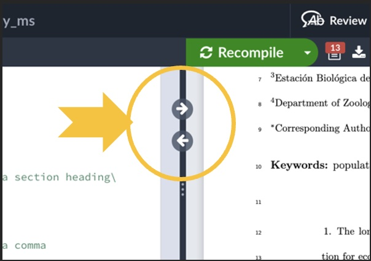
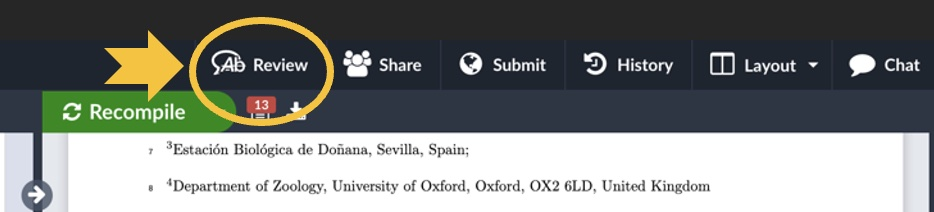
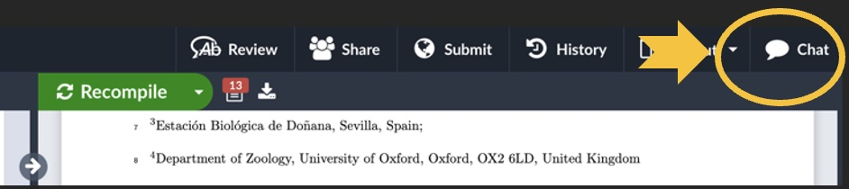

## Overleaf 101

Overleaf is an online LaTeX editor that has a lot of great features including simultaneous editing by multiple authors, simple commenting and track changes, and excellent built-in version control. It is a bit different than Microsoft Word or Google Docs, but not by much! Here is a quick overview to help you figure out how (and why) to navigate and contribute to documents written on Overleaf.  

Overleaf is LaTeX editor that is hosted online. LaTeX is word processing software that allows you to write in plain text and use code (rather than buttons or menus like in Word) to do the formatting. You can also write mathematical notation easily, create and customize tables, and insert and manage citations and bibliographies. 

Once a LaTeX file is completed, it is usually compiled into a PDF. If you are OK with commenting on the PDF version of a file, then no need to read further. However, if you’d like to change the text or contents of the compiled PDF file, you’ll need to edit the LaTeX source document. This can happen in any LaTeX editor, including Overleaf. Here are the basic steps: 

## Navigating to the Overleaf Document

Go to the web address provided by the author of the document. Depending on the settings the author chose, you may need to make an Overleaf account. However, a basic account is free and should allow you to do everything you’ll need to contribute to a manuscript. The link should lead you to a page that looks something like this:  

The LaTeX source code file is on the left, and a preview of the compiled PDF is on the right. If you make any changes to the source file on the left and then click the “Recompile” button, those changes will appear in the PDF preview on the right. You can change the relative size of the panels by dragging the divider between the two from side to side.

The beginning of the source file has multiple lines of commands that determine the format of the PDF. In LaTeX, anything that starts with a “\” and is blue is a command. You shouldn’t need to change any of the commands in the source file if you’re providing input on the text. It’s also good to note that anything that appears green or is preceded by a “%” will not be included in the PDF. If you scroll down a bit in the source file, you should be able to find where the text of the document starts (i.e., where text that appears on the right also appears in the source code). 

## Making Changes

It’s up to you whether you want to read through the document in the source code panel on the left or the PDF preview on the right. However, if you want to change the text or leave a comment, you’ll need to do that in the source file on the left panel. Once you find the text in the source file that you want to change, you can type just like you would in any text editor. 

You can use keyboard shortcuts to make text bold or italicized, and Overleaf will automatically add the appropriate command to the source code (since formatting isn't' done with commands). If you’d like to remove any text, you can just delete it, or you can add a “%” before the text. This is the equivalent of  “#” in R, so anything following a “%” in that line will not be compiled in the PDF.
 
The document owner should have turned on track changes, but you can make sure before changing anything by clicking the “Review” button in the upper left toolbar. 
 

 
 

  
  
  
 
This will cause a pane to come up on the right-hand side of the source file. In the upper part of the pane, you should see that track changes is toggled to “on” and that the button beside either “Everyone” or “Guests” is toggled to the green position. 

 
 
 
 
 
 
 

 

A useful tool when editing documents is the set of arrow buttons that are located on the dividing line between the two panels. These allow you to navigate to the location in the PDF that corresponds to your location in the source file (using the right-pointing arrow) and vice-versa. They’re great if you’re reading in the PDF and want to change the corresponding text in the source file, or if you want to see what a change in source file text will look like in the PDF.

## Leaving Comments

There are two easy ways to make comments in an Overleaf document. The first is to leave an inline comment in the source file. You can do this anywhere in the source text using “%” and typing your comment. To make it easier to find and respond to inline comments, it’s handy if you repeat the percent sign three times, followed by your initials, followed by your comment. For example, “%%%AES: Here is my comment…..”. Once you’re done typing the comment, make sure to hit the “return” key so the following text in the line won’t be commented out.  

If you’d like to leave a comment next to the text like you do in Microsoft Word, you can do this too! Press the “Review” button to make the comment pane appear. 
  
  
 
As you scroll through the source file, previous comments will appear in this pane. The text that existing comments refer to is highlighted in yellow in the source file. You can respond to previous comments just as you would in Word. 

If you’d like to leave a new comment, make sure that the review pane is open, highlight the text you want to comment on, and then click the “add comment” button that appears in the review pane. 

There is also a “Chat” where you can type any general comments, questions, etc. The chat pane appears when you click the “Chat” button in the upper right corner. 
 
   
    

Because Overleaf is an online software, all of your changes are saved automatically and are visible to anyone else with permission to view or edit the document. So once you're finished leaving comments and making edits, that's it! You don't need to save or send anything (although it never hurts to let coauthors know that you're finished commenting).

Hopefully this is a good start and gives you everything you need to make comments and edits to a manuscript! 
