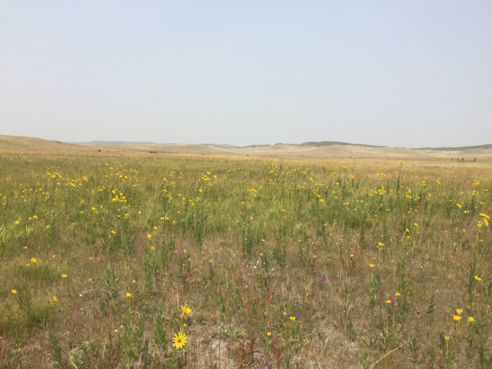

   
          
A major goal in ecology is to make generalizable predictions of organism responses to environmental variation based on their traits. However, straightforward relationships between traits and fitness are rare and likely vary with environmental context. Characterizing how traits mediate demographic responses to the environment may enhance predictions of organism responses to global change. 

In this project, we synthesized 15 years of demographic data and species-level traits in a shortgrass steppe to determine whether the effects of leaf and root traits on growth and survival depend on seasonal water availability. 

<h6 class="ttu tracked black-10 pv2 mt4 bt b--black-10"></h6>

          
 

We found that graminoids with more negative leaf turgor loss point (TLP), a physioloigcal trait that indicates the water potential at which a platn begins to wilt, and higher leaf dry matter content (LDMC) and root dry matter content (RDMC) had higher survival rates in drier years. Forbs demonstrated similar yet more variable responses. Graminoids grew larger in wetter years, regardless of traits. However, in both wet and dry years, graminoids with more negative TLP and higher LDMC and RDMC grew larger than less negative TLP and low LDMC and RDMC species. 

Traits significantly mediated the impact of drought on survival, but not growth, suggesting survival could be a stronger driver of species’ drought response in this system. TLP predicted survival in drier years, but easier-to-measure LDMC and RDMC were equal or better predictors. These results advance our understanding of the mechanisms by which drought drives population dynamics, and show that abiotic context determines how traits drive fitness. 

<h6 class="ttu tracked black-10 pv2 mt4 bt b--black-10"></h6>

          
   

## Learn More
Read more about this project **[here](https://doi.org/10.1002/ecy.3799)**, in our paper published in Ecology. 

If you'd like to reproduce our anlyses, you can do so using the R code found either on [Zonodo](https://doi.org/10.5281/zenodo.6647755) or [GitHub](https://github.com/aestears/CO-Sgs-paper), and data archived on [Dryad](https://datadryad.org/stash/dataset/doi:10.5061/dryad.31zcrjdp5) (in combination with previously published data referenced in the manuscript.)

Stears, Alice E., Peter B. Adler, Dana M. Blumenthal, Julie A. Kray, Kevin E. Mueller, Troy W. Ocheltree, Kevin R. Wilcox, Daniel C. Laughlin. 2022. Water availability dictates how plant traits predict demographic rates. Ecology. e3799. [doi:10.1002/ecy.3799](https://doi.org/10.1002/ecy.3799)

