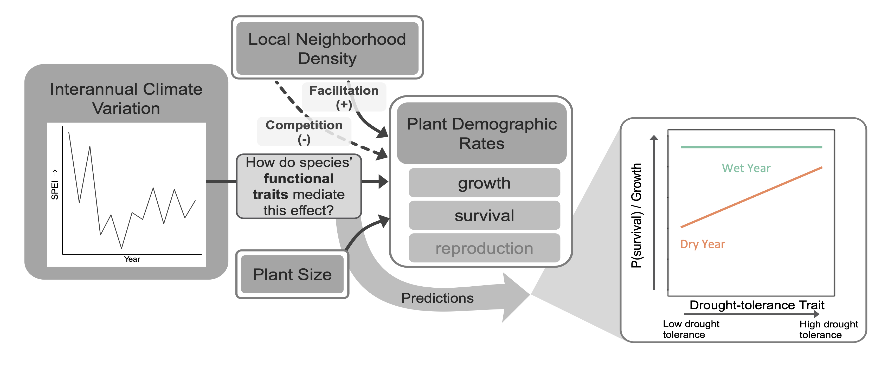
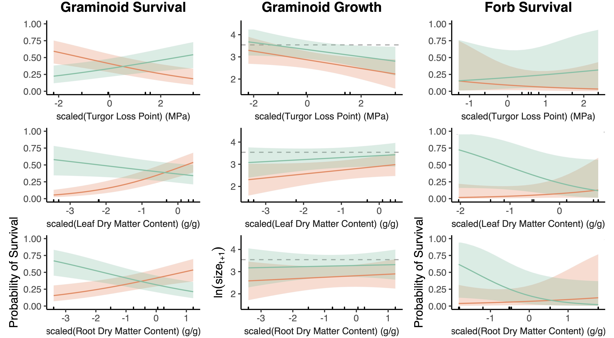
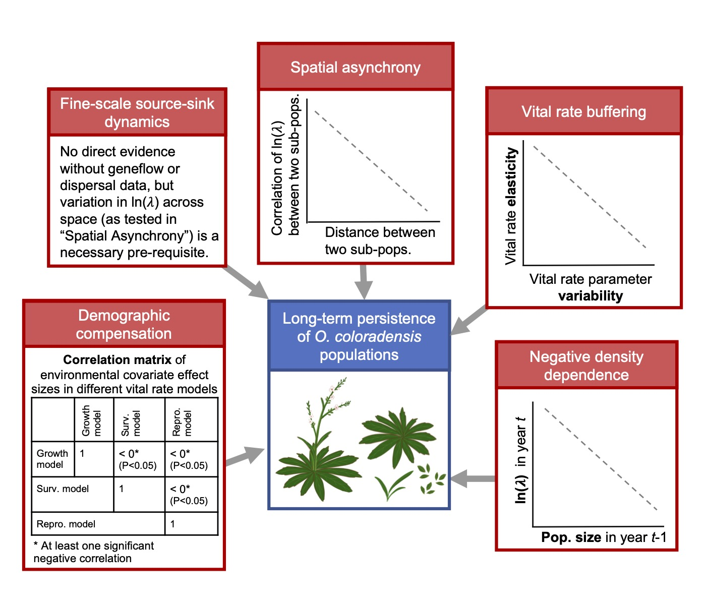

+++
title = "Research"
description = ""
author = "Alice Stears"
date = "2021-03-04"
layout = "about"
tags = [""]
categories = [""]
+++

### Trait-mediated demographic response to drought in the Colorado shortgrass steppe 
A major goal in ecology is to make generalizable predictions of organism responses to environmental variation based on their traits. However, straightforward relationships between traits and fitness are rare and likely vary with environmental context. Characterizing how traits mediate demographic responses to the environment may enhance predictions of organism responses to global change. In this project, we synthesized 15 years of demographic data and species-level traits in a shortgrass steppe to determine whether the effects of leaf and root traits on growth and survival depend on seasonal water availability. 

   
          
          
We found that graminoids with more negative leaf turgor loss point (TLP), a physioloigcal trait that indicates the water potential at which a platn begins to wilt, and higher leaf dry matter content (LDMC) and root dry matter content (RDMC) had higher survival rates in drier years. Forbs demonstrated similar yet more variable responses. Graminoids grew larger in wetter years, regardless of traits. However, in both wet and dry years, graminoids with more negative TLP and higher LDMC and RDMC grew larger than less negative TLP and low LDMC and RDMC species. Traits significantly mediated the impact of drought on survival, but not growth, suggesting survival could be a stronger driver of species’ drought response in this system. TLP predicted survival in drier years, but easier-to-measure LDMC and RDMC were equal or better predictors. These results advance our understanding of the mechanisms by which drought drives population dynamics, and show that abiotic context determines how traits drive fitness. 

   

Read more about this project **[here](https://doi.org/10.1002/ecy.3799)**, in our paper published in Ecology. 

If you'd like to reproduce our anlyses, you can do so using the R code found either on [Zonodo](https://doi.org/10.5281/zenodo.6647755) or [GitHub](https://github.com/aestears/CO-Sgs-paper), and data archived on [Dryad](https://datadryad.org/stash/dataset/doi:10.5061/dryad.31zcrjdp5) (in combination with previously published data referenced in the manuscript.)

Stears, Alice E., Peter B. Adler, Dana M. Blumenthal, Julie A. Kray, Kevin E. Mueller, Troy W. Ocheltree, Kevin R. Wilcox, Daniel C. Laughlin. 2022. Water availability dictates how plant traits predict demographic rates. Ecology. e3799. [doi:10.1002/ecy.3799](https://doi.org/10.1002/ecy.3799)

### plantTracker R package

Long-term demographic data are rare yet invaluable for conservation, management, and basic research on the underlying mechanisms of population and community dynamics. Historical mapped datasets of plant basal area present a relatively untapped source of demographic records that, in some cases, span over 20 years of sequential data collection. However, these maps did not uniquely mark individual plants, making the process of collecting growth, survival, and recruitment data more difficult. Recent efforts to translate paper maps of historical quadrats into shapefiles make it possible to use computer algorithms to track individuals through time and determine individual growth and survival. We created the [plantTracker R package](https://www.astearsresearch.com/package/plantTracker/), which contains user-friendly functions to extract local neighborhood and demographic data from historical quadrat maps, as well as any other repeatedly sampled maps of stationary organisms. This package contains two primary functions: trackSpp(), which tracks individuals through time and assigns demographic data, as well as getNeighbors(), which calculates both within and between-species local neighborhood occupancy around each mapped individual. plantTracker also contains functions to estimate plot-level recruitment, calculate plot-level population growth rate, and create quadrat maps. 

Find out more about this project in our **[paper](https://doi.org/10.1111/2041-210X.13950)** published in Methods in Ecology and Evolution, at the [package website](https://www.astearsresearch.com/package/plantTracker/), [GitHub repository](https://github.com/aestears/plantTracker), and [CRAN page](https://CRAN.R-project.org/package=plantTracker). 

Stears, Alice E., Peter B. Adler, Shannon E. Albeke, David H. Atkins, Jared Studyvin, Daniel C. Laughlin. 2022. plantTracker: An R package to translate maps of plant occurrence into demographic data. Methods in Ecology and Evolution. 13(10): 2129-2137. [doi:10.1111/2041-210X.13950]( https://doi.org/10.1111/2041-210X.13950)

### Demographic mechansims of persistence for the rare monocarpic perennial *Oenothera coloradensis* 

The persistence of naturally rare species has long been a motivating question for ecologists. Classical theory implies that community dynamics should be driven by common species, and that natural selection should not allow small populations of rare species to persist over long periods. And yet, a majority of the species found on earth are rare. Rare species contribute to diversity, community stability, and ecosystem function, and several mechanisms have been proposed to explain their persistence. We used size-based integral projection models (IPMs) to examine the population dynamics of Oenothera coloradensis, a rare, endemic, monocarpic perennial forb, and determined whether any of five proposed demographic mechanisms for rare species persistence were acting in populations of this species. We also evaluated the importance of including a discrete seedbank stage in population models of this species. 

   

We determined that the seedbank is important for O. coloradensis, and that including a seedbank stage in population models has a significant impact on modeled population growth rate. IPMs that included a size-based continuous state and discrete seedbank state indicated that neither negative density dependence, demographic compensation, vital rate buffering, spatial asynchrony, nor fine-scale source-sink dynamics are acting to maintain the positive growth we observed in O. coloradensis subpopulations. Instead, we propose that high micro-site abundance allows this species to sidestep the demographic and genetic challenges of small population size that rare species typically face. 

### Trait-mediated demographic response to drought across the western US

